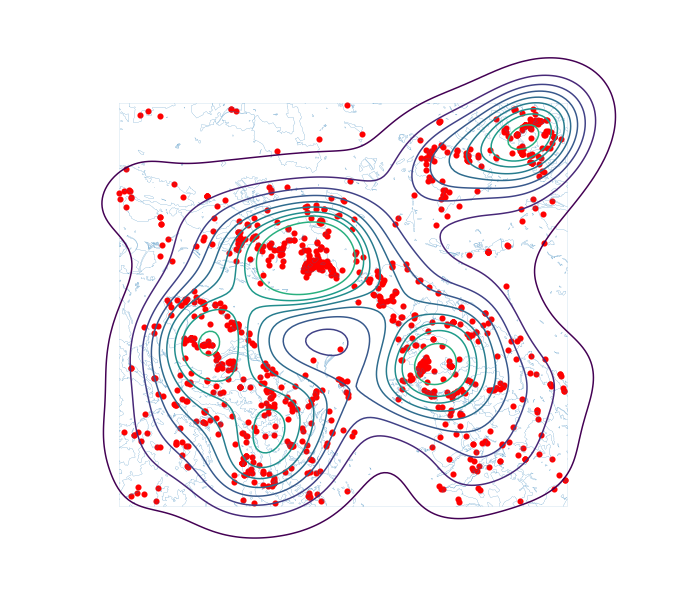
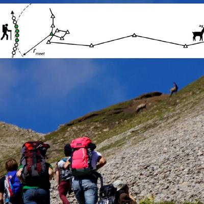
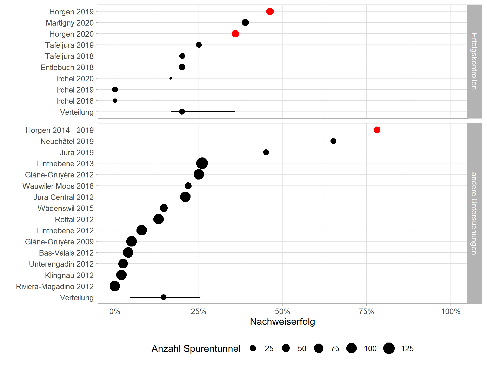
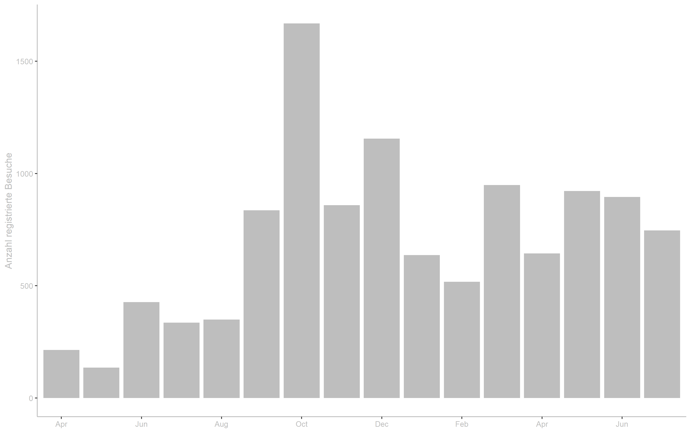
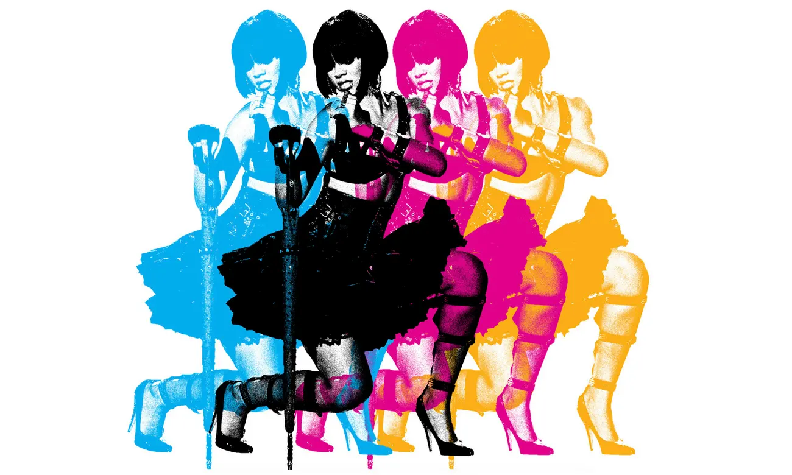
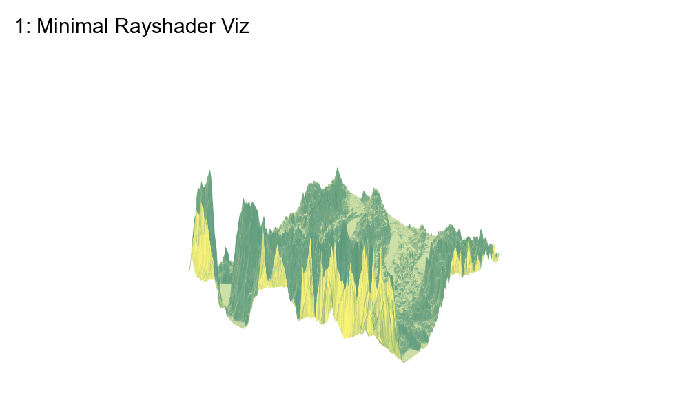
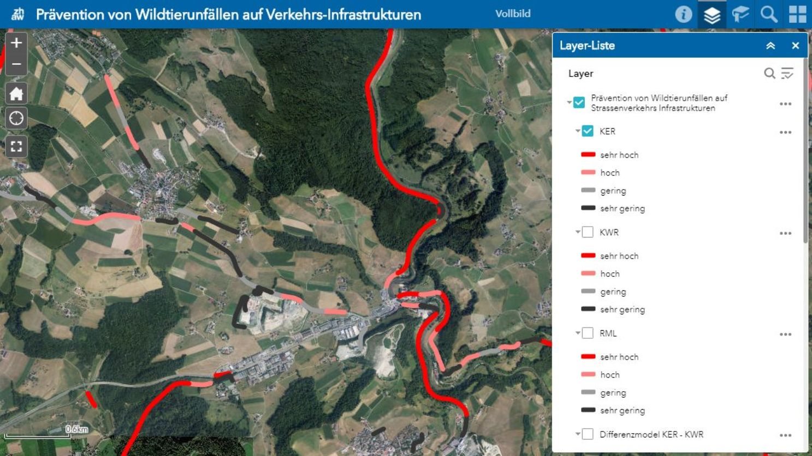

### Hi there 👋

My repos are organized over two github sites ([github.com](https://github.com/ratnanil) and [github.zhaw.ch](https://github.zhaw.ch/rata)) in various "organisations" I created. I've described some projects here: 

<table cellpadding="50" border = "0">
  <tr>
    <td></td>
    <td>
    An introduction to Spatial R for ArcGIS users  
    https://github.com/arc2r/book  
    https://github.com/arc2r/arc2r
  </tr>
  <tr>
    <td></td>
    <td>
    An introduction to GIS in Python for Environmental Scientists (Bachelor Students)  
    https://github.com/Modul-AGI/HS20
    </td> 
  </tr>
  <tr>
    <td></td>
    <td>
    Computational Movement Analysis: Detecting Patterns and Trends in Environmental Data. A course taught by Prof. Dr. Patrick Laube, I was responsible for creating the R-exercises.  
    https://github.com/ComputationalMovementAnalysis/FS21
    </td> 
  </tr>
  <tr>
    <td></td>
    <td>
    Results from the weasle study 2019 / 2020 
    https://github.com/wieselundco/erfolgskontrolle
    </td> 
  </tr>
  </tr>
  <tr>
    <td></td>
    <td>
    Updates on weasle research @ ZHAW (slides)  
    https://github.com/ratnanil/WIN_Praesentation_2021
    </td> 
  </tr>
  <tr>
    <td></td>
    <td>
    How do you document (ESRI-) Python Toolboxes inline? 
    https://github.com/ratnanil/PythonToolboxDocumentation
    </td> 
  </tr> 
  <tr>
    <td></td>
    <td>
    A Compilation of songs, created with bookdown 
    https://github.com/ratnanil/songs  
    https://github.com/ratnanil/songbookdown (R-Package)
    </td> 
  </tr> 
  <tr>
    <td></td>
    <td>
    The repo for my blog, hosted on nils.ratnaweera.net 
    https://github.com/ratnanil/myblog
    </td> 
  </tr>   
  <tr>
    <td></td>
    <td>
    A Python Toolbox (Based on ArcGIS Software) to model hotspots of wildlife-vehicle collisions (wvc)  
    https://github.zhaw.ch/ASTRA/PythonToolbox
    </td> 
  </tr>
  
</table>

<!--
**ratnanil/ratnanil** is a ✨ _special_ ✨ repository because its `README.md` (tdis file) appears on your Gitdub profile.

Here are some ideas to get you started:

- 🔭 I’m currently working on ...
- 🌱 I’m currently learning ...
- 👯 I’m looking to collaborate on ...
- 🤔 I’m looking for help witd ...
- 💬 Ask me about ...
- 📫 How to reach me: ...
- 😄 Pronouns: ...
- ⚡ Fun fact: ...
-->
